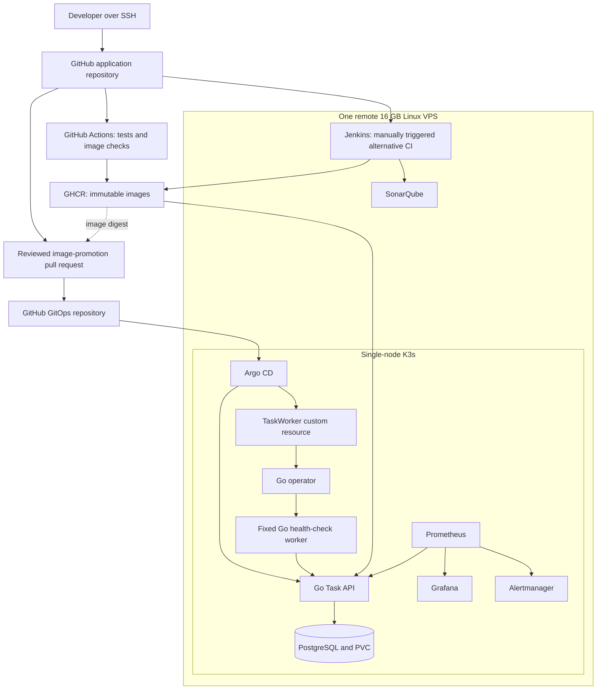

# Cloud Infrastructure Platform

> Historical project draft: the current [README](README.md) and
> [Consul/Vault learning flow](docs/service-discovery-and-secrets.md) govern
> the AWS, ECR, service discovery, and secrets direction. VPS/GHCR assumptions
> and the original tool scope below are retained as planning history.

## Purpose

Build and operate a Go Task Management API on a single cloud server running Kubernetes. Automate infrastructure provisioning, application delivery, code quality checks, monitoring and recovery. Add a small Go Kubernetes operator to learn reconciliation through a narrowly defined workload.

This is a ten-day, 80-hour portfolio and learning project for Cloud Engineer, SRE, DevOps and Platform Engineer applications. It is a production-oriented lab, not a highly available enterprise platform. The outcome is working software, operational evidence and the ability to explain each design decision independently.

## Repository identity

- **Project name:** Cloud Infrastructure Platform
- **Main GitHub repository:** `cloud-infrastructure-platform`
- **Companion GitOps repository:** `cloud-infrastructure-platform-gitops`
- **Main repository description:** Go application platform on Kubernetes with Terraform, Helm, GitHub Actions, Jenkins, Argo CD, Prometheus, Grafana, and a custom Kubernetes operator.
- **Status at creation:** Planned. Change to In progress when implementation starts. Mark individual capabilities complete only after verification.

The companion repository contains deployment configuration, not a second portfolio project. Separating it makes image promotion and deployment history easy to review.

## Scope and constraints

- One remote Linux VPS: 16 GB RAM, at least 4 vCPUs, preferably 8, and approximately 150–200 GB SSD.
- No application, cluster or build environment runs on the laptop. Use SSH or an editor connected to the server.
- GitHub hosts source code, GitOps configuration and pull requests. GHCR stores images. GitHub Actions can use hosted runners subject to account allowances.
- Use K3s as the single-node Kubernetes distribution. The node runs both control-plane and application workloads.
- Use free/community tool editions. The server, backups and any provider services may incur charges. Check current prices before provisioning.
- Run at most one Jenkins build or heavy analysis operation at a time. Keep dashboards, scraping and retention small.
- The server provider is not yet selected. Terraform must use that provider's supported resources; do not claim AWS infrastructure experience from a non-AWS VPS.
- AWS/EKS, multi-node failure testing, multi-region infrastructure, a web frontend and generic self-service environments are later extensions.

## User-facing application

The application is deliberately simple: a REST API that creates, lists, updates and deletes tasks in PostgreSQL.

### API contract

| Endpoint | Behaviour |
|---|---|
| `POST /tasks` | Create a task with a validated title; return 201 |
| `GET /tasks` | Return tasks with bounded pagination |
| `GET /tasks/{id}` | Return a task or 404 |
| `PATCH /tasks/{id}` | Update allowed fields or return validation/not-found errors |
| `DELETE /tasks/{id}` | Delete a task; document repeat-delete behaviour |
| `GET /healthz` | Process liveness; must not fail merely because PostgreSQL is unavailable |
| `GET /readyz` | Readiness, including a bounded database check |
| `GET /metrics` | Internal Prometheus metrics; do not expose publicly |

Use consistent JSON error responses, request size limits, query timeouts and structured logs. Include request IDs without logging credentials or secrets.

Task fields: `id`, `title`, `description`, `status`, `created_at`, `updated_at`. Limit status to `todo`, `in_progress`, or `done`. Use a versioned initial migration and backward-compatible changes during this project.

No user account system is required. Use synthetic data and keep the API private by default. If enabling a public demonstration, add ingress authentication and traffic limits first.

## Technology stack

| Technology | Responsibility | Learning outcome |
|---|---|---|
| Go and standard HTTP library | API and fixed health-check worker | Errors, contexts, timeouts, interfaces where useful, testing and shutdown |
| PostgreSQL and pgx | Data persistence | SQL, migrations, connection pooling, transactions where needed and restoration |
| Linux, SSH and systemd | Host operation | Users, permissions, processes, ports, services, disk and memory diagnosis |
| Terraform and cloud-init | VPS/firewall provisioning and initial bootstrap | State, plans, lifecycle, dependencies and reproducibility |
| Docker/BuildKit | Image construction | Multi-stage builds, non-root runtime and reproducible artifacts |
| K3s | Kubernetes cluster | Deployments, Services, Secrets, probes, RBAC, PVCs and troubleshooting |
| Helm | Application and upstream tool packaging | Templates, values, release lifecycle and compatibility |
| GitHub Actions | Primary CI | Pull-request checks, permissions, artifacts and image publishing |
| GHCR | API, worker and operator images | Tags, digests, package visibility and retention |
| Jenkins | Alternative CI exercise | Jenkinsfile, executor, credentials, stages and failure diagnosis |
| SonarQube Community Build | Code analysis and imported Go coverage | Findings, quality gates and scanner integration |
| Trivy | Image vulnerability scanning | Severity policy, remediation and justified exceptions |
| Argo CD | Application GitOps delivery | Desired state, sync, drift and recovery through Git |
| Prometheus | Scrape and query metrics | PromQL, labels, service discovery and alert rules |
| Grafana | Dashboards | Traffic, errors, latency and resource investigation |
| Alertmanager | Alert routing | Grouping, inhibition, silencing and delivery tests |
| Kubebuilder/controller-runtime | Go operator | CRDs, reconciliation, ownership and idempotency |
| k6 | Load and failure exercises | Throughput, latency and measurement limitations |

Pin compatible stable versions when implementation begins, including Kubernetes, chart, Go and controller dependencies. Record the actual tested versions in `docs/versions.md`; do not use unqualified `latest` references.

## High-level architecture



The diagram groups logical responsibilities, not exact network boundaries. Jenkins and SonarQube can run as host-managed containers, leaving their lifecycle independent of the application cluster. K3s runs workloads with its own container runtime; Docker is used for builds and host tooling.

### Ownership boundaries

| Owner | Resources |
|---|---|
| Terraform | Provider VPS, firewall and explicitly selected provider resources |
| cloud-init/bootstrap scripts | Host prerequisites and initial K3s/tool setup |
| Manual bootstrap Helm releases | Argo CD and monitoring stack, with configuration committed to Git |
| Argo CD | Application chart and, later, operator installation/custom resource |
| Go operator | Only the worker Deployment created from a TaskWorker resource |
| Secret bootstrap procedure | Runtime Secrets and administrative credentials; no plaintext in Git |

Do not manage the same resource with both the operator and Helm/Argo CD. Once Argo CD owns the application, avoid manual Helm upgrades for that release. Recover by changing desired state in Git.

## CI and delivery design

### Main pipeline

1. Pull request: format checks, `go vet`, unit tests and integration tests using PostgreSQL.
2. Run race detection where feasible. Generate test coverage; preserve useful reports.
3. Build and scan the image. Fix findings or document a narrow, justified exception rather than disabling all checks.
4. On trusted main-branch changes, publish an image to GHCR tagged with the commit SHA and record its digest.
5. Open a manual pull request in the GitOps repository updating the image digest. Automatic PR generation is optional.
6. After merge, Argo CD syncs the application. Validate readiness and API behaviour.
7. Recover a bad application release by reverting the GitOps commit and syncing. Database migrations require their own compatibility plan; an image rollback cannot undo arbitrary schema changes.

Use public GHCR packages for the portfolio images where appropriate, or configure explicit pull credentials for private packages. Never rely on a cached image as proof that a fresh node can pull it.

### Jenkins and SonarQube

Jenkins checks out the same GitHub repository and calls the same checked-in test/build scripts. Trigger it manually and publish optional `jenkins-<sha>` tags without promoting them automatically.

SonarQube runs on the VPS. The default project design runs its scan from Jenkins, which can reach it privately, and enforces the quality gate there. GitHub Actions still runs tests and image scanning. Do not assume a GitHub-hosted runner can reach a private SonarQube endpoint. A private self-hosted runner or authenticated HTTPS endpoint is an optional integration, not a prerequisite.

Restrict privileged build access to trusted code and limit Jenkins to one executor. Do not execute untrusted fork pull requests on a runner attached to this server.

## Kubernetes and Helm design

- Namespaces: `task-app`, `task-operator`, `argocd`, `monitoring`.
- Go API: one replica initially; temporarily use two to observe rollout behaviour. Two replicas on one node do not provide node-level availability.
- PostgreSQL: single instance with a PVC and a separate Secret. Persistence on the same disk is not an off-server backup.
- Health checks: liveness for process health and readiness for serving traffic. Use realistic initial delays and timeouts.
- Set CPU/memory requests and limits after observing the workload. Avoid allocating all 16 GB to pod requests.
- Use the installed ingress controller for HTTP/TLS where needed. Access administrative UIs through SSH tunnels or authenticated, restricted HTTPS.
- Service accounts receive minimal permissions. Do not use cluster-admin for the application or worker.
- Test Helm rendering/linting and commit environment-specific values without secrets.

## Small Go operator

Example desired state:

```yaml
apiVersion: platform.example.com/v1alpha1
kind: TaskWorker
metadata:
  name: task-checker
  namespace: task-app
spec:
  replicas: 1
```

The worker periodically calls the API readiness endpoint with a timeout and logs success/failure. Its image and target service are configured by the operator deployment, not arbitrary user input.

The operator must:

1. Validate a small replica range, such as 1–3.
2. Create the fixed Deployment and set the TaskWorker as its owner.
3. Update replicas and correct relevant drift without unnecessary writes on every reconciliation.
4. Watch owned Deployments so deletion triggers recreation.
5. Report observed generation and ready replicas/status.
6. Allow Kubernetes garbage collection to remove the Deployment when the TaskWorker is deleted.

No external cloud resources are managed, so custom finalizers are not needed for the first version. Explain when a finalizer would become necessary. Test repeat reconciliation and partial failures.

## Observability and incident exercises

Install a small `kube-prometheus-stack` Helm release with Grafana and Alertmanager. Adapt it to K3s; disable unsupported control-plane scrape targets rather than leaving unexplained alerts permanently firing.

Instrument the API with request count, request duration histogram and in-flight requests. Use bounded labels such as HTTP method, route template and status class. Never use task IDs or request IDs as metric labels.

Dashboard panels:

- Requests per second, error ratio, p95 latency.
- Ready replicas/restarts and CPU/memory usage.
- Node disk usage and available memory.
- Database pool indicators if supported by the application instrumentation.

Create an alert for sustained elevated errors or an unavailable API. Verify both firing and resolution. A test webhook receiver can record delivery without requiring email or messaging credentials.

Keep 24–48 hours of metrics initially with a storage size limit. Central log storage and tracing are outside the ten-day scope; use structured application logs and `kubectl logs`.

Required exercises:

1. Invalid image tag or failing readiness after a release; diagnose and revert through GitOps.
2. Database connection failure; correlate readiness, logs and alert behaviour, then recover.
3. Delete the operator-owned Deployment; observe recreation and explain why it occurred.
4. Back up synthetic database data and restore into a separate database; verify expected records.

## Server capacity and access

Reserve approximately 3–4 GB for the OS, Kubernetes overhead, filesystem cache and bursts. The remaining memory is a planning envelope, not a guarantee. Measure actual usage and tune each component. Run SonarQube analysis, image builds and load tests sequentially. Stop idle Jenkins/SonarQube services if needed.

Clean old images and build caches, cap logs and metrics retention, and keep an off-server backup of data/state needed for recovery. Keep SSH key authentication, firewall rules and restricted admin access in place before deploying UIs.

Terraform bootstrapping needs a small manual first step: create the provider account/API token and provision the VPS from a temporary hosted runner or provider console. Import a manually created VPS if that path is used. Never depend on the VPS being alive as the only way to recreate or destroy it. Preserve state in access-controlled remote storage or an encrypted off-server backup; do not publish state in Git or public artifacts.

## Suggested repository layout

```text
cloud-infrastructure-platform/
├── cmd/{api,worker}/
├── internal/{httpapi,store,config,telemetry}/
├── migrations/
├── operator/                     # Kubebuilder project
├── deploy/charts/task-platform/
├── deploy/{argocd,monitoring}/    # Versioned bootstrap values
├── infra/terraform/vps/
├── infra/cloud-init/
├── scripts/                      # Shared build/test/backup scripts
├── tests/{integration,load,recovery}/
├── docs/{architecture,decisions,runbooks,incidents,evidence}/
├── .github/workflows/
├── Dockerfile
├── Jenkinsfile
├── Makefile
└── README.md

cloud-infrastructure-platform-gitops/
├── applications/
├── environments/lab/             # Image digests and non-secret values
└── README.md
```

These paths are proposed implementation outputs, not existing code. Tag a tested app/chart revision for GitOps rather than combining mutable chart source with an unrelated image digest.

## Definition of done

- Another engineer can follow prerequisites and setup instructions without undocumented credentials or manual edits.
- The API works with persisted data; meaningful tests pass.
- Images pull from GHCR on a clean environment.
- CI failures block publication/promotion as designed; a SonarQube gate is demonstrated in Jenkins.
- Argo CD deploys a reviewed change and restores the previous compatible release after a revert.
- Metrics are scraped; the dashboard works; an alert fires, reaches the test receiver and resolves.
- Operator reconciliation and garbage collection are demonstrated.
- Database restoration is verified using records, not just a successful command exit.
- Provisioning/state recovery and teardown procedures are documented and tested to the extent claimed.
- No secrets, private keys, tokens or Terraform state are committed.
- README includes actual architecture, tested versions, costs, limitations and evidence links.

## Portfolio and interview evidence

Keep a short demonstration, two incident reports, an architecture diagram and decisions explaining K3s versus EKS, a single node versus high availability, GitHub Actions versus Jenkins, and Helm versus an operator.

Explain what was implemented, what failed and how you diagnosed it. Report measurements with workload, duration and environment details. Do not describe lab results as production improvements.

### CV wording after completion

- Developed and containerised a Go REST API with PostgreSQL, automated tests, health checks and graceful shutdown; deployed on a Terraform-provisioned cloud server running K3s.
- Built GitHub Actions and Jenkins CI pipelines for testing, code analysis, vulnerability scanning and image publishing; implemented GitOps delivery using Helm and Argo CD.
- Instrumented application metrics and configured Prometheus, Grafana and Alertmanager; documented failure diagnosis, deployment recovery and database backup-and-restore exercises.
- Developed a Go Kubernetes operator using Kubebuilder to reconcile a custom worker resource, manage replica changes, correct deployment drift and clean up dependent resources.

Use only completed, verified claims. This project demonstrates hands-on project experience, not additional years of employment or AWS/EKS operation.

## Later extensions

After the ten-day acceptance checks: temporary Terraform-managed AWS/EKS deployment, external secrets, OpenTelemetry tracing, Loki/Tempo, multi-node recovery tests, and CloudGraph integration. Add one extension at a time with a concrete purpose and evidence.
